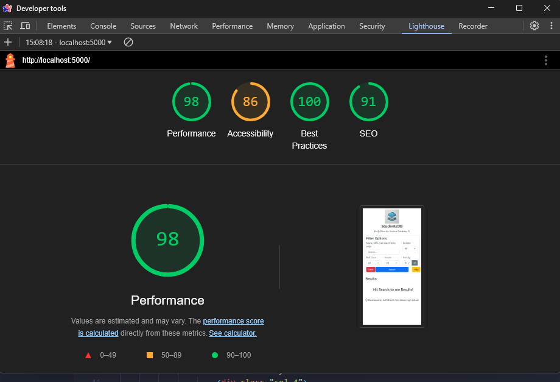
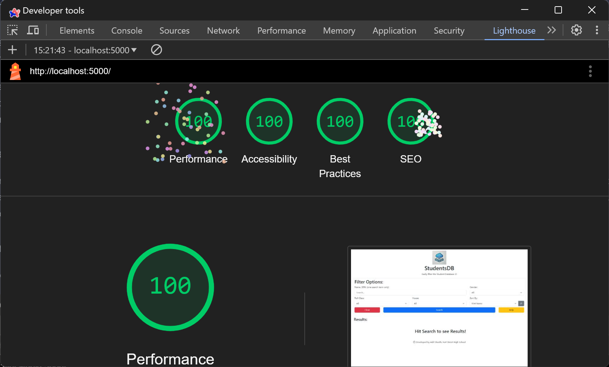
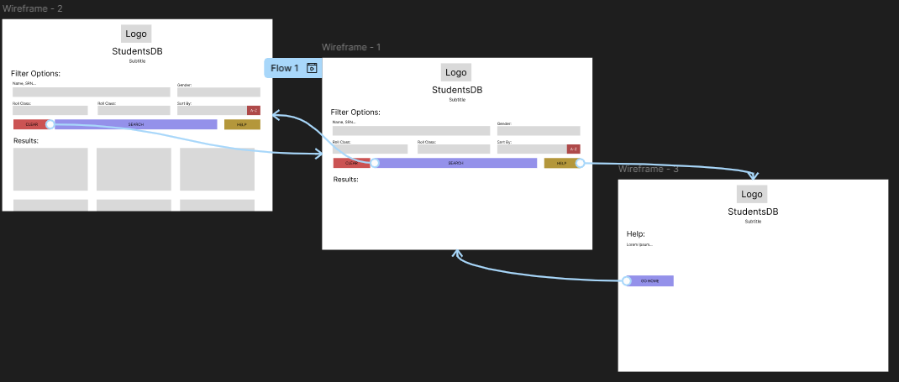
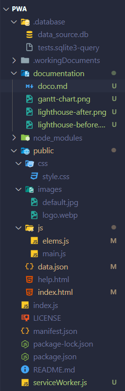
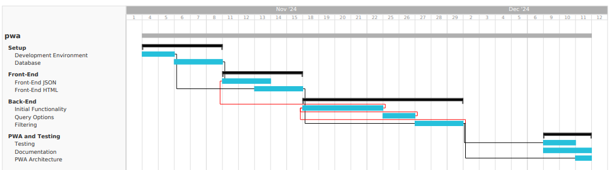

# SWE Term 1 - Progressive Web App
## By Adil Sheeth

### 1. Set up your Development Environment
Following the instructions on the TempeHS Github, I created the basic directory structure for my project, including the `css`, `js` and `images` folders, as well as `index.html`, `index.js`, and `app.js`.
Additionally, I installed NodeJS, SQLite3 (in VSCode), and initialised a Git repository.

### 2. Set up the Database
To start, I found a spreadsheet from last year containing information about 180 students. Using this spreadsheet, I created a CSV file with the following fields:

| Field | Type | Example |
|  :---:  |  :---: |   :---:   |
| srn | integer | 442094063 |
| first_name | text | Adil |
| last_name | text | Sheeth |
| gender | text | M |
| school_year | text | Year 10 |
| roll_class | text | 10.1 |
| dob | text | 21-12-2007 |
| house | text | BATMAN |

Then, I used the following query to create the `students` database.

```SQL
CREATE TABLE students(
    srn INTEGER NOT NULL PRIMARY KEY, 
    first_name TEXT NOT NULL,
    last_name TEXT NOT NULL,
    gender TEXT NOT NULL,
    school_year TEXT NOT NULL,
    roll_class TEXT NOT NULL,
    dob TEXT NOT NULL,
    house TEXT NOT NULL
);
```

### 3. Construct the Front-End JSON file
I altered the given code to create a faster, more efficient algorithm for converting the SQL Query results into a JSON file.

```javascript
db.all(myQuery, (err, rows) => {
        if (err) {
            console.log(err)
        }
        fs.writeFileSync("public/data.json", JSON.stringify(rows, null, 4))
    })
```
### 4. Code the look of the Front-End
In the planning stage, I created a basic wireframe for my app, consisting of two pages (`home` and `help`), and how they interact with each other. I've included my storyboard later in Section 10.

In my project, I utilised the `Bootstrap` library for its easily accessible, responsive elements. To do this, I added the following `script` and `link` tags to my two `HTML` files:
```html
<link href="https://cdn.jsdelivr.net/npm/bootstrap@5.3.3/dist/css/bootstrap.min.css" rel="stylesheet" integrity="sha384-QWTKZyjpPEjISv5WaRU9OFeRpok6YctnYmDr5pNlyT2bRjXh0JMhjY6hW+ALEwIH" crossorigin="anonymous">
```
```html
<script src="https://cdn.jsdelivr.net/npm/bootstrap@5.3.3/dist/js/bootstrap.bundle.min.js" integrity="sha384-YvpcrYf0tY3lHB60NNkmXc5s9fDVZLESaAA55NDzOxhy9GkcIdslK1eN7N6jIeHz" crossorigin="anonymous"></script>
```
Bootstrap's styling made it extremely easy for me to design a minimal, clean looking front-end, without having to write any CSS myself. Instead, to style and add margins or paddings to an element, all I had to do was add it to the `class` attribute. For example, here's the code for the search button:
```html
<button type="submit" id="submit" class="btn btn-primary">Search</button>
```

### 5. Code Initial Functionality
To insert data into my database, I used SQLite's built-in bulk import function, importing the CSV file created earlier. Then, to test my database, I ran a simple query to verify that my database was functional.
```sql
SELECT * FROM students
```
### 6. Plan Query Options
To create filtering options to filter the data using SQL, I created a custom query constructor in the Express server configuration file (`index.js`). Upon pressing submit on the filter form, the values of each input is sent to the backend through browser parameters. The backend then uses the custom query constructor to create a query based on the parameters provided, and generates a JSON file, which is then displayed by the frontend. 

| Input | Process | Output | File |
| :---: | :---: | :---: | :---: |
| Use data from the form on `index.html` | Convert into parameters | Add parameter to URL | `elems.js` |
| Use Parameter from URL | Create SQL Query  | Generate JSON file | `index.js` |
| Use JSON file | Create card elements for each entry | Display elements on `index.html` | `main.js` |

This process allows users to filter and sort the database as they require, allowing them to easily search through the database without any knowledge of SQL.

### 7. Code Remaining Functionality
Using an AGILE development approach, I continued to plan and design different features for my catalogue container and query options, ensuring to test each feature as I went along. This allowed me to quickly identify and fix any bugs or issues that arose during development, before deploying the final product. Features I implemented include:
- Search by SRN and Name
- Filter by House, Gender and Roll Class
- Sort by SRN, First Name, and Last Name, in both Ascending and Descending order

### 8. Implement Progressive Web App Architecture
To make my project a Progressive Web App, I included a `manifest.json` file, which contains metadata about the app, such as the name, description, and icon. Additionally, I added the Bootstrap library (including icons) to my project, which allowed me to easily create a responsive, mobile-friendly design. Finally, I added a service worker to cache the app, allowing it to be used offline (This hasn't been fully implemented yet).

### 9. Testing
To conduct accessibility testing, I used the Lighthouse tool in Google Chrome, which analyses the performance, accessibility, best practices, and SEO of a website. The result of the initial test was:



Certainly room for improvement. Following the suggestions given, such as adding `alt-text` to images, `aria-labels` to buttons, and using headings in the correct order, I was able to improve the accessibility of my website. The final test result was (the sprinkles wouldn't disappear):



Additionally, I conducted user testing with a few of my peers, who provided feedback on the design and functionality of my app. This feedback was invaluable, as it allowed me to identify and fix any issues that I had overlooked, and improve the overall user experience of my app. This included adding a `clear` and `help` button, as well as improving the design of the form to be more user-friendly and intuitive, such as adding red, blue and yellow colours to the buttons.

### 10. Project Documentation

#### Process Diary/ Logbook
| Date | Description |
| :---: | :---: |
| 1/11 | Set up the development environment by installing all required VSCode extensions (including the recommended ones), Node.js, and Git Bash. Had issues configuring Bash in VSCode, but a restart and PATH update fixed it quickly. Ready to start the development process. |
| 4/11 | Helped Lilly set up her development environment. |
| 5/11 | Helped Tony set up his development environment, and taught him how to actually follow the instructions :/ |
| 8/11 | Forked Github template and created the basic development file structure. Utilised the Git Bash terminal to create folders and files. Stopped at the Database structure section of the instructions in order to determine what data is going to be used (current idea is a student database). |
| 11/11 | Helped fix Lilly's database error for a whole double period (she was missing a quote :/) |
|15/11| Created a CSV file with student data, and used it to create a database in SQLite. |
|1/12| Created the basic front end, linked it to the database, and created a JSON file to store the data. |
|2/12 to 6/12 | Exam Block, no work 
|9/12| Started to implement Bootstrap, and tried to make the front end look better. I also brainstormed ideas on how to connect the front and back ends.|
|10/12| Experimented with different frameworks such as React and Angular, to no avail. Settled on using Express' parameters feature to pass data instead. Created my custom SQL query constructor and linked it to the back-end. Created `params.js` to pass data from the form to the backend. |
|11/12| Restarted the project, copying over the database only. Restructured my project directory to make it more cohesive. Finally figured out why my JS wasn't executing, and fixed Refined Bootstrap implementation and started to style the resultant cards. Styled the page layout better, and added sort options (ascending and descending). Added a ReadMe, logo, and manifest.json. |
|12/12| Finished the project, conducted accessibility testing, added serviceWorker.js (with nothing in it), conducted user testing, and did all this documentation. |

#### Storyboard/ Wireframe
Here's the storyboard I created for my project, which outlines the different pages and how they interact with each other. This helped me to visualise the project and plan out the development process, ensuring that I didn't miss any key features or functionality.


#### Directory Structure
Here's the final directory structure of my project, with all the files and folders neatly organised into their respective categories. This structure makes it easy to navigate and find files, and ensures that the project is well-organised and easy to maintain.



#### Gantt Chart
A Gantt Chart is useful to plan out the development process, and ensure that all tasks are completed on time. Here is the planned Gantt Chart for my project, separated into sections for each section of the project:



#### User tests and Query Examples
User testing was conducted to ensure that the app was user-friendly and intuitive. Some feedback given includes changing the size of the buttons to be bigger, and adding a note that only one search term can be used. Additionally, the GitHub release was tested on three different devises to ensure that it was responsive and worked on all devices. 

Since I've created a custom SQL Query constructor, the query combinations are endless. Here are some examples of queries that can be made using the app:
```sql
-- Example Single Queries
SELECT * FROM STUDENTS  WHERE (first_name LIKE '%Adil%' OR last_name LIKE '%Adil%' OR srn = 'Adil')  ORDER BY first_name ASC;

SELECT * FROM STUDENTS  WHERE (gender = 'M')  ORDER BY first_name ASC;

SELECT * FROM STUDENTS  ORDER BY last_name DESC;

-- Example Compound Queries
SELECT * FROM STUDENTS  WHERE (first_name LIKE '%Ansh%' OR last_name LIKE '%Ansh%' OR srn = 'Ansh')  AND (gender = 'M')  AND (house = 'MARSDEN')  ORDER BY last_name DESC;

SELECT * FROM STUDENTS  WHERE (first_name LIKE '%454920155%' OR last_name LIKE '%454920155%' OR srn = '454920155')  AND (gender = 'F')  AND (roll_class = 'SRC')  AND (house = 'BATMAN')  ORDER BY first_name ASC;
```
